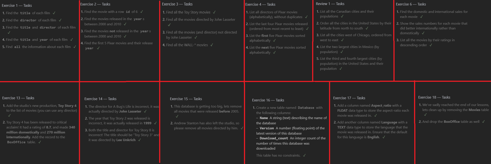

# Prep Assignment

## SQL Practice

### Relational Databases and SQL

- Structured Query Language, or SQL is a language designed to query, manipulate and transform data from a database. Due to the simplicity of the language it allows for safe and easily scaleable storage for websites and applications.
- To full understand how SQL works, you need to know how Databases work. A database is essentially a collection of tables and if you are familiar with Excel, it looks like an Excel Spreadsheet with a fixed number of columns with an infinite amount of rows.
- To format a database query, the language is simple and very human-readable with the most basic query to find specific data being `SELECT * FROM Table`, which simply grabs all the data from a specfic database table.
- To make the query more specific, you use the `WHERE` clause to specify a condition to check against.
  - For example, `SELECT * FROM Table WHERE Year = 1995` in a database about movies would return every movie released in 1995 that is in the database
- You can also add the `DISTINCT` keyword before the table to remove duplicate entries from being displayed.
- Using the `ORDER BY` clause you can sort the column in Ascending or Decending Order
- To limit the number of results returned, you use the `LIMIT` clause and if you want a specific section, the `OFFSET` clause will offset the results from the top by the number given
- To reference multiple tables that share information about the same entry are linked by a `primary key` that is the identifier for that entry across the database.
  - By using the `JOIN` clause, you can merge the information from multiple tables into the same query return based upon identifying the linked keys.
- Now to create and manipulate database rows requires a similarly human-readable format.
  - The `INSERT INTO` statement will insert a new row or set of rows based upon the values you give it.
  - The values you give it are dependent upon how the database is set up and the required values to make a valid entry.
  - The `UPDATE` statement will update a row of data based upon the `WHERE` conditon you feed it, so it is critical you know exactly where you are updating to make sure you update the correct entry.
    - Using the `SET` clause you define what column you want to update and what new information to update it with, ensuring the data types are the same.
  - To delete a row, you simply need the `DELETE FROM Table` statement with the `WHERE` clause. Once again, be absolutely sure you are targeting the correct row. Check Twice, Execute Once.
- To create an entirely new table is similarly easy to understand once you know how to do it.
  - To start, you use the `CREATE TABLE Table-Name`Statement to create the table and then within `()` you define the initial columns to use and the constraints they need.
  - The format for the columns are `name DataType Constraints DEFAULT default_value,`. Of those, `Constraints`, and `DEFAULT default_value` are optional depending on the column.
- To alter a table, such as adding columns you use the `ALTER TABLE Table-Name` statement with the `ADD name DataType Constraint DEFAULT default_value` clause, with the constaints and defaults still optional, but it is good practice to add the defauts to avoid needing to change all previous `INSERT INTO` querys to accomadate the new column.
- To remove a column you use the `DROP column-name` clause on the `ALTER TABLE` statement, However, some databases don't support this.
- To rename the table, you use the `RENAME TO new-table-name` clause on the `ALTER TABLE` statement.
- To delete the entire table in one go, you use the `DROP TABLE Table-Name` statement.
