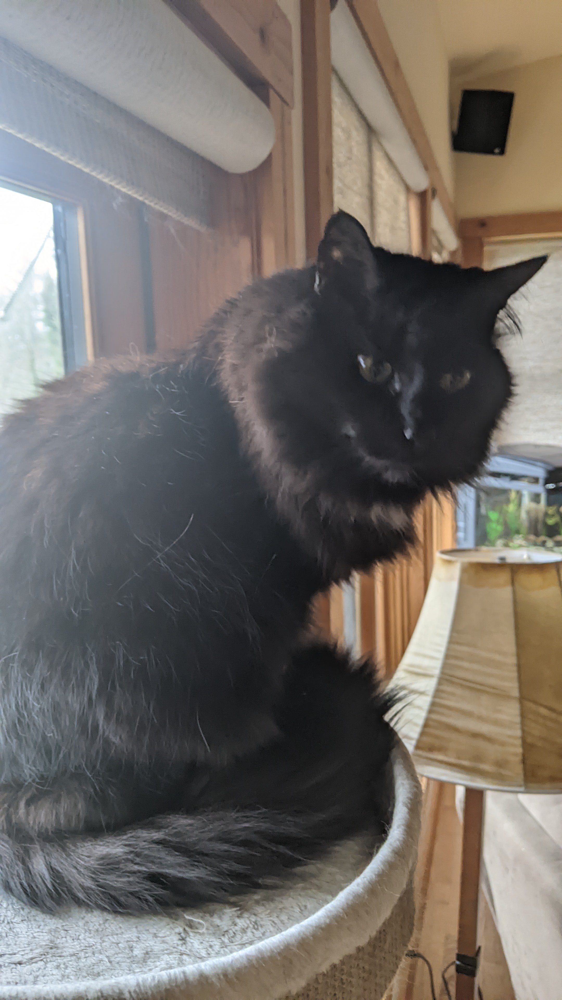

# Reading Notes

## About Myself 
Hello, My name is James Brooks, I am 20 years old and I'm excited to work with you all in the future. 
I have a Bernese Mountain Dog(Hogarth) and 2 cats(Snape & Weasley) 

 
And I couldn't get a picture of my other cat(Weasley), So just imagine the same cat but Orange and fatter.

## Table of Contents

### Code 201

---

-

### Code 102

---

- [Growth Mindset](https://jamesbrooks01.github.io/reading-notes/Code102/GrowthMindset)
- [Learning Markdown Summary](https://jamesbrooks01.github.io/reading-notes/Code102/LearningMarkdownSummary)
- [Learning Markdown](https://jamesbrooks01.github.io/reading-notes/Code102/LearningMarkdown)
- [Terminal Cheat Sheet](https://jamesbrooks01.github.io/reading-notes/Code102/TerminalCheatSheet)
- [The Coder's Computer](https://jamesbrooks01.github.io/reading-notes/Code102/TheCoder'sComputer)
- [Revisions And The Cloud](https://jamesbrooks01.github.io/reading-notes/Code102/RevisionsAndTheCloud)
- [Design Webpages With HTML](https://jamesbrooks01.github.io/reading-notes/Code102/DesignWebpagesWithHTML)
- [Design Webpages With CSS](https://jamesbrooks01.github.io/reading-notes/Code102/DesignWebpagesWithCSS)
- [Dynamic Webpages With JavaScript](https://jamesbrooks01.github.io/reading-notes/Code102/DynamicWebpagesWithJavaScript)
[LinkedIn](https://www.linkedin.com/in/james-brooks-8270b3170/) 
[GitHub](https://github.com/JamesBrooks01) 
