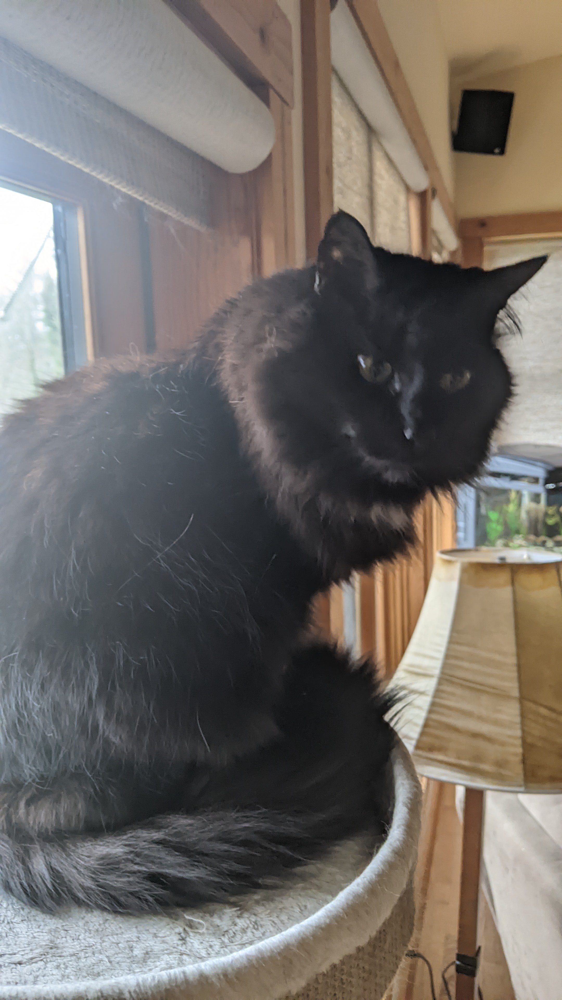

# Reading Notes

## About Myself 
Hello, My name is James Brooks, I am 20 years old and I'm excited to work with you all in the future. 
I have a Bernese Mountain Dog(Hogarth) and 2 cats(Snape & Weasley) 

 
And I couldn't get a picture of my other cat(Weasley), So just imagine the same cat but Orange and fatter.

## Table of Contents

### Code 401 - Advanced Software Development - Python

- [Prep Work: Growth Mindset](https://jamesbrooks01.github.io/reading-notes/Code401/growthMindset)
- [Prep Work: Introduction To SQL](https://jamesbrooks01.github.io/reading-notes/Code401/introductionToSQL)
- [Prep Work: Practice In The Terminal](https://jamesbrooks01.github.io/reading-notes/Code401/practiceInTheTerminal)
- [Class 01: Readings: Topic](https://jamesbrooks01.github.io/reading-notes/Code401/class-01)
- [Class 02: Testing and Modules](https://jamesbrooks01.github.io/reading-notes/Code401/class-02)
- [Class 03: FileIO & Exceptions](https://jamesbrooks01.github.io/reading-notes/Code401/class-03)
- [Class 04: Classes/Objects, Recursive Thinking, and Pytest Fixtures and Coverage](https://jamesbrooks01.github.io/reading-notes/Code401/class-04)
- [Class 05: Linked Lists](https://jamesbrooks01.github.io/reading-notes/Code401/class-05)
- [Class 06: Ten Thousand Game 1](https://jamesbrooks01.github.io/reading-notes/Code401/class-06)

### Code 301 - Intermediate Software Development

---

- [Class 01: Introduction to React and Components](https://jamesbrooks01.github.io/reading-notes/Code301/class-01)
- [Class 02: State and Props](https://jamesbrooks01.github.io/reading-notes/Code301/class-02)
- [Class 03: Passing Functions as Props](https://jamesbrooks01.github.io/reading-notes/Code301/class-03)
- [Class 04: React and Forms](https://jamesbrooks01.github.io/reading-notes/Code301/class-04)
- [Class 05: Putting it all together](https://jamesbrooks01.github.io/reading-notes/Code301/class-05)
- [Class 06: NODE.JS](https://jamesbrooks01.github.io/reading-notes/Code301/class-06)
- [Class 07](https://jamesbrooks01.github.io/reading-notes/Code301/class-07)
- [Class 08: APIs](https://jamesbrooks01.github.io/reading-notes/Code301/class-08)
- [Class 09: Functional Programming](https://jamesbrooks01.github.io/reading-notes/Code301/class-09)
- [Class 10: In Memory Storage](https://jamesbrooks01.github.io/reading-notes/Code301/class-10)
- [Class 11: Mongo and Mongoose](https://jamesbrooks01.github.io/reading-notes/Code301/class-11)
- [Class 12: CRUD](https://jamesbrooks01.github.io/reading-notes/Code301/class-12)
- [Class 13: More CRUD](https://jamesbrooks01.github.io/reading-notes/Code301/class-13)
- [Class 14: Diversity & Inclusion in the Tech Industry](https://jamesbrooks01.github.io/reading-notes/Code301/class-14)
- [Class 14: Authentication](https://jamesbrooks01.github.io/reading-notes/Code301/class-15)

### Code 201 - Foundations of Software Development

---

- [Class 01: Introductory HTML and JavaScript](https://jamesbrooks01.github.io/reading-notes/Code201/class-01)
- [Class 02: HTML Text, CSS Introduction, and Basic JavaScript Instructions](https://jamesbrooks01.github.io/reading-notes/Code201/class-02)
- [Class 03: HTML Lists, CSS Boxes, JS Control Flow](https://jamesbrooks01.github.io/reading-notes/Code201/class-03)
- [Class 04: HTML Links, CSS Layout, JS Functions](https://jamesbrooks01.github.io/reading-notes/Code201/class-04)
- [Class 05: HTML Images; CSS Color & Text](https://jamesbrooks01.github.io/reading-notes/Code201/class-05)
- [Class 06: JS Object Literals; The DOM](https://jamesbrooks01.github.io/reading-notes/Code201/class-06)
- [Class 07: HTML Tables; JS Constructor Functions](https://jamesbrooks01.github.io/reading-notes/Code201/class-07)
- [Class 08: More CSS Layout](https://jamesbrooks01.github.io/reading-notes/Code201/class-08)
- [Class 09: Forms and Events](https://jamesbrooks01.github.io/reading-notes/Code201/class-09)
- [Class 10: JS Debugging](https://jamesbrooks01.github.io/reading-notes/Code201/class-10)
- [Class 11: Assorted Topics](https://jamesbrooks01.github.io/reading-notes/Code201/class-11)
- [Class 12: Docs for the HTML `<canvas>` Element & Chart.js](https://jamesbrooks01.github.io/reading-notes/Code201/class-12)
- [Class 13: Local Storage](https://jamesbrooks01.github.io/reading-notes/Code201/class-13)
- [Class 14a: CSS Transforms, Transitions, and Animations](https://jamesbrooks01.github.io/reading-notes/Code201/class-14a)
- [Class 14b: What Google Learned About Teams](https://jamesbrooks01.github.io/reading-notes/Code201/class-14b)

### Code 102 - Intro to Software Development

---

- [Growth Mindset](https://jamesbrooks01.github.io/reading-notes/Code102/GrowthMindset)
- [Learning Markdown Summary](https://jamesbrooks01.github.io/reading-notes/Code102/LearningMarkdownSummary)
- [Learning Markdown](https://jamesbrooks01.github.io/reading-notes/Code102/LearningMarkdown)
- [Terminal Cheat Sheet](https://jamesbrooks01.github.io/reading-notes/Code102/TerminalCheatSheet)
- [The Coder's Computer](https://jamesbrooks01.github.io/reading-notes/Code102/TheCoder'sComputer)
- [Revisions And The Cloud](https://jamesbrooks01.github.io/reading-notes/Code102/RevisionsAndTheCloud)
- [Design Webpages With HTML](https://jamesbrooks01.github.io/reading-notes/Code102/DesignWebpagesWithHTML)
- [Design Webpages With CSS](https://jamesbrooks01.github.io/reading-notes/Code102/DesignWebpagesWithCSS)
- [Dynamic Webpages With JavaScript](https://jamesbrooks01.github.io/reading-notes/Code102/DynamicWebpagesWithJavaScript) 

[LinkedIn](https://www.linkedin.com/in/james-brooks-8270b3170/) 
[GitHub](https://github.com/JamesBrooks01) 
